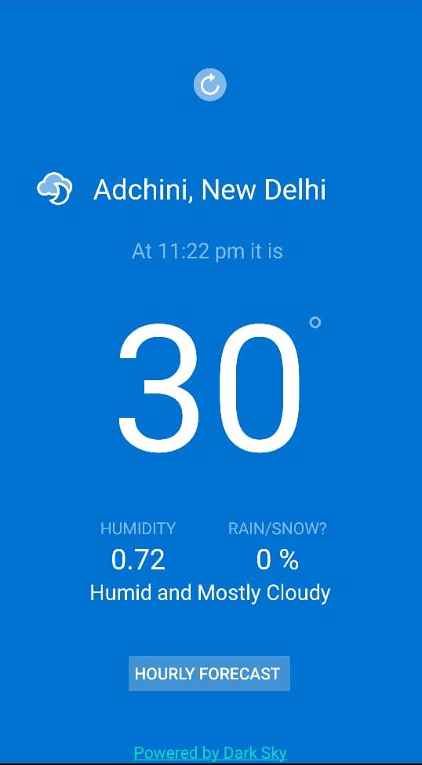
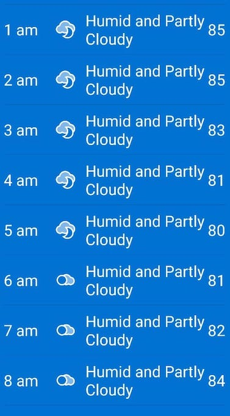

# Stormy
Stormy is a weather application which requests weather forecast data from an API provided by [darksky.net](https://darksky.net/dev).

This is an android application which is build using java.

## Weather Updates Screen

## Hourly Forecast Screen

# Features
- [x] Simple Design
- [x] Option to view hourly forecast
- [x] Works with any place in the world
- [x] Easy to use and install

# Getting Started
You need to have android studio installed on your device and create an Android Virtual Device to run full Android OS and test the application.

## Installation
* Clone the repository in a directory of your choice
* Open the Minesweeper folder with Android Studio
* Build the gradle file
* Now you can test the application on either android virtual device or your android device

Feel free to use and contribute!
*The weather icons and design mockups are provided by [Treehouse](https://teamtreehouse.com)*
